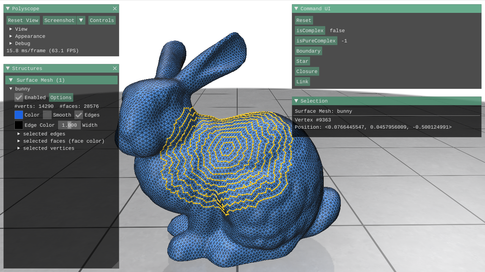
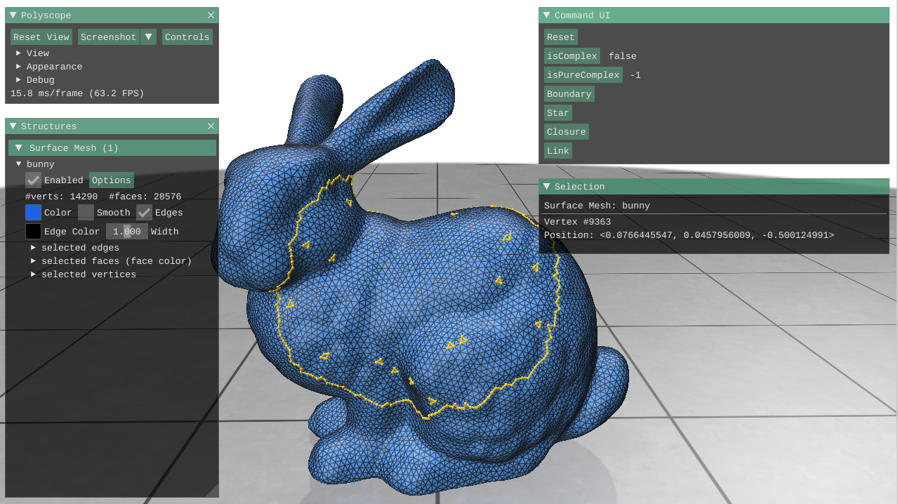
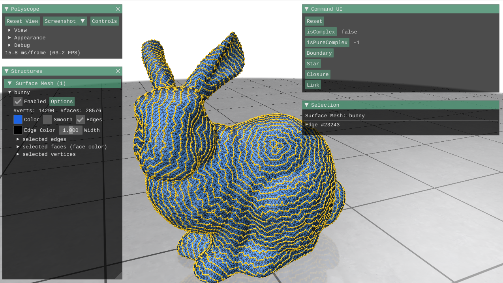

# ddg-exercises

My implementations for exercises of CMU [Discrete Differential Geometry](https://brickisland.net/DDGSpring2020/) (15-458/858).

Please refer to the original [README](./README_ddg.md) for details.

## Assignment 0: Combinatorial Surfaces

Apply the `link` operator many times started from a single vertex:

Then apply the `star`, `closure`, and `boundary` operator:

A "stable" state of applying the `link` operator multiple times started from the edges of a single triangle (pretty fun, huh?):

