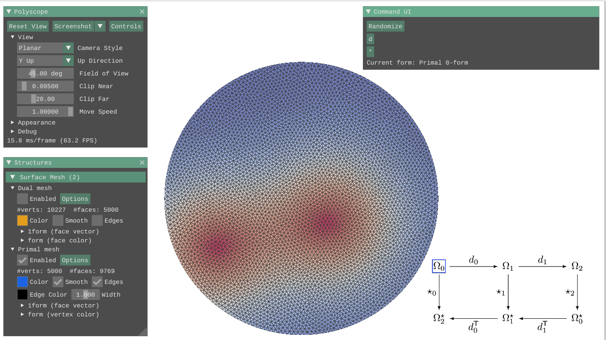
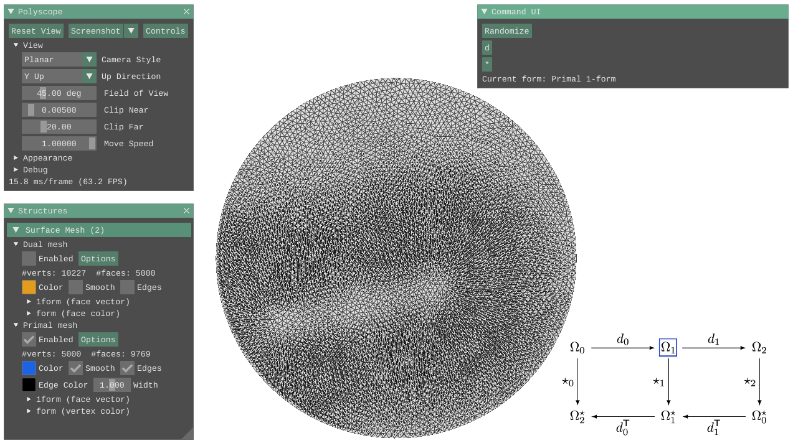
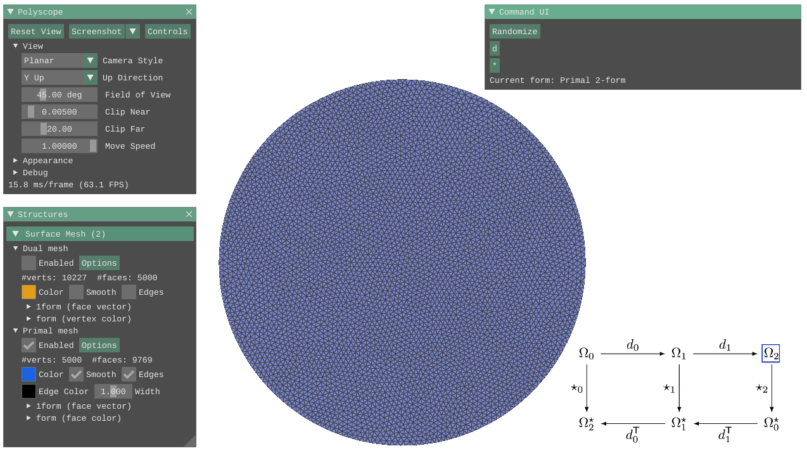
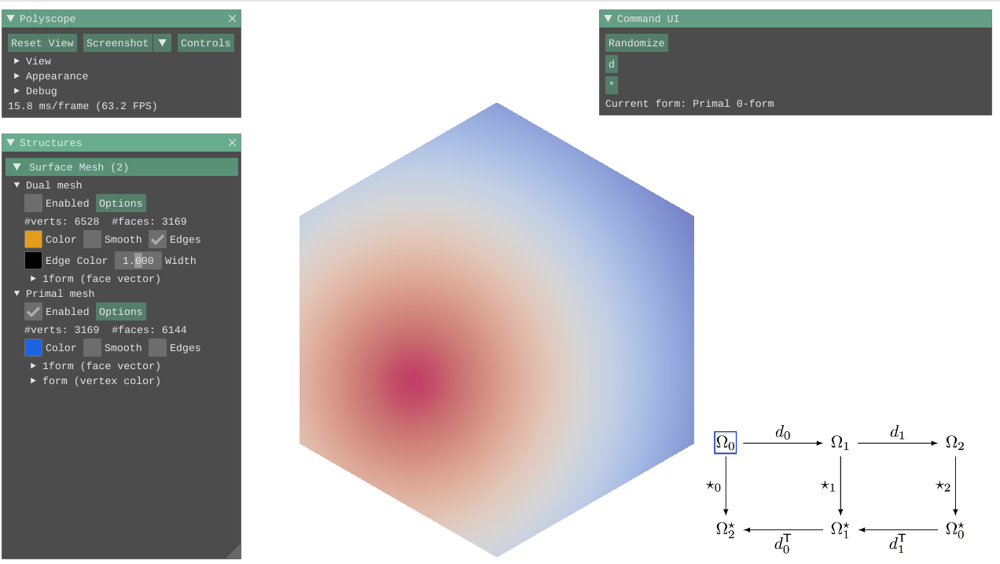
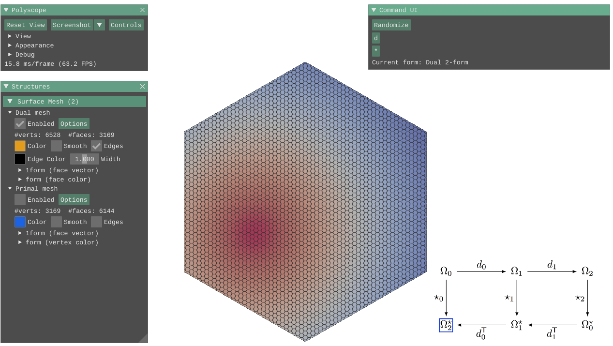

# ddg-exercises

Implementation of code assignments of CMU [Discrete Differential Geometry](https://brickisland.net/DDGSpring2020/) (15-458/858).

Please refer to the original [README](./README_ddg.md) for details.

## Assignment 0: Combinatorial Surfaces

Apply the `link` operator many times starting from a single vertex:

Then apply the `star`, `closure`, and `boundary` operator:

A "stable" state of applying the `link` operator multiple times starting from the edges of a single triangle:

## Assignment 1: Exterior Calculus

Visualize $dd\alpha = 0$:

Hodge star (dual):

